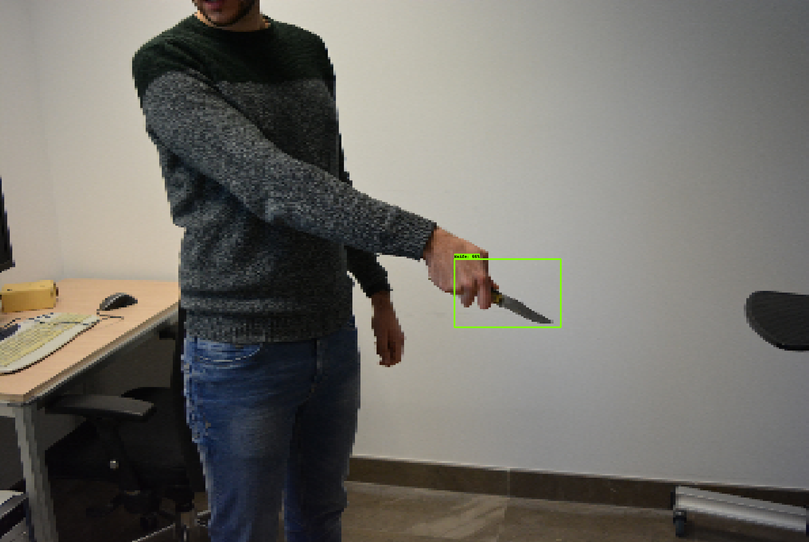

## Knife-Detection-using-SSD-Deep-Learning-Model

This repository contains the code for training an SSD deep learning model architecture for the detection of knifes that appears in images. Moreover, Inceptin V2 is used as the base network. For development, [google colab](https://colab.research.google.com/notebooks/intro.ipynb) is used.

## Data

Data was downloaded from [here](https://github.com/ari-dasci/OD-WeaponDetection/tree/master/Knife_detection) directly into google drive in the Jupyter Note code.

## Results

Some detection results along with confidence score, after training for 200k steps: 

  
  
  
  

Tensorboard:

## Resources

- [How to train an object detection model](https://www.dlology.com/blog/how-to-train-an-object-detection-model-easy-for-free/)
- [Understanding SSD MultiBox — Real-Time Object Detection In Deep Learning](https://towardsdatascience.com/understanding-ssd-multibox-real-time-object-detection-in-deep-learning-495ef744fab)
- [SSD object detection: Single Shot MultiBox Detector for real-time processing](https://jonathan-hui.medium.com/ssd-object-detection-single-shot-multibox-detector-for-real-time-processing-9bd8deac0e06)
- [3 steps to update parameters of Faster R-CNN/SSD models in TensorFlow Object Detection API](https://towardsdatascience.com/3-steps-to-update-parameters-of-faster-r-cnn-ssd-models-in-tensorflow-object-detection-api-7eddb11273ed)
- [Brightness guided preprocessing for automatic cold steel weapon detection in surveillance videos with deep learning](https://www.sciencedirect.com/science/article/abs/pii/S0925231218313365)
